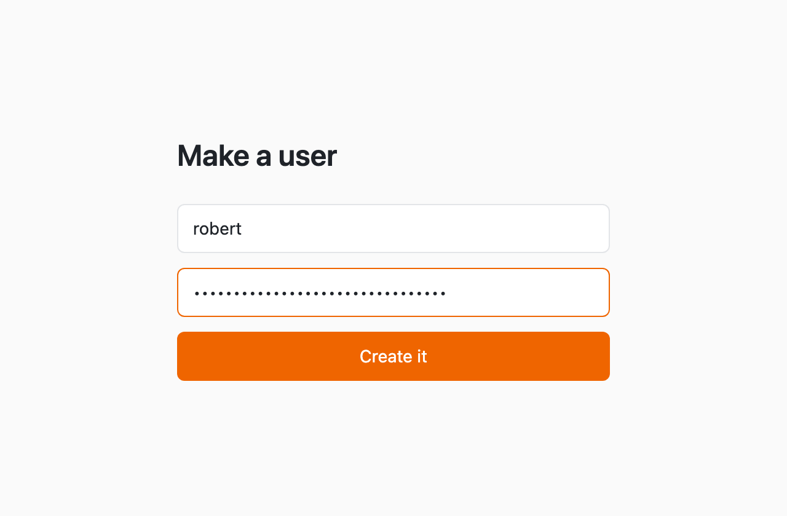
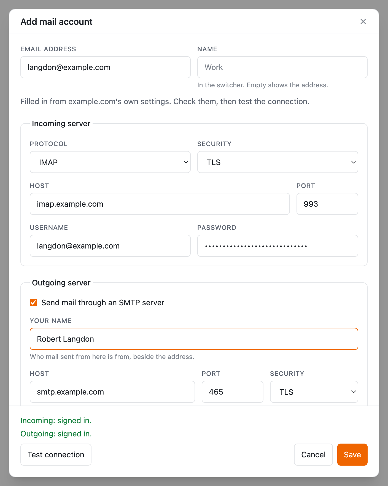
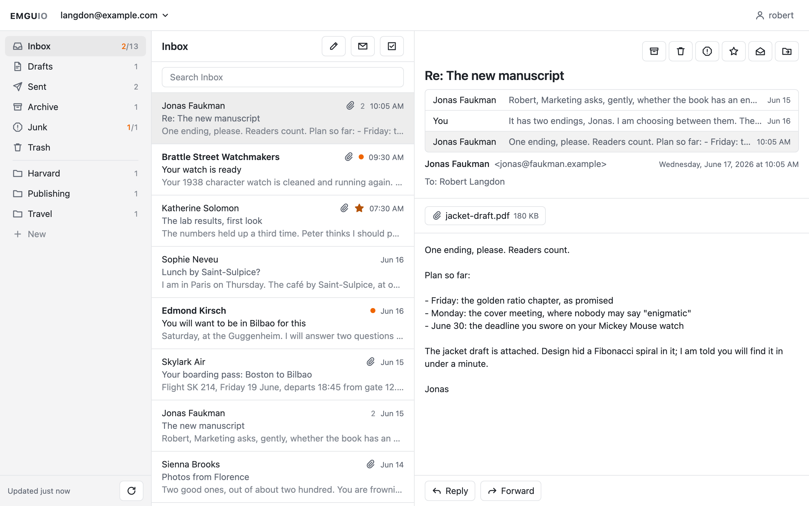

# emguio

A self-hosted webmail client. Each user adds the mail servers they read from — an incoming
IMAP server and, optionally, an outgoing SMTP one — and reads their mail in the browser.

- **Self-hosted.** One static binary, one SQLite file, one port.
- **Invitation only.** A user exists because somebody with a shell on the host printed a link.
- **Email configs belong to the user.** Added in Settings rather than in a config file, and never
  mixed: one is shown at a time.

Early: users add their email configs and read their mail — folders, lists, messages with their attachments, HTML shown safely, remote images through a proxy that hides the reader and held back in Junk. Only INBOX's newest headers are kept; everything else is read from the server when it is asked for. Read, star, archive, delete, spam and move — one message or a selection — are done on the server, and a folder is searched there too; a message shows the conversation it is in, where the server threads. Mail is written and sent from here: new, reply, reply all and forward, through the config's outgoing server, and kept in Drafts as it is written.

## Install

### 1. Compose it

Behind [caddy-docker-proxy](https://github.com/lucaslorentz/caddy-docker-proxy), which gives it a
certificate from its labels and reaches it over the external `caddy` network:

```yaml
# compose.yml
services:
  emguio:
    image: ghcr.io/reeywhaar/emguio:latest
    restart: unless-stopped
    environment:
      EMGUIO_PUBLIC_URL: https://mail.example.com
      EMGUIO_SECRET_KEY: ${EMGUIO_SECRET_KEY}
    volumes:
      - emguio-data:/data
    networks:
      - caddy
    labels:
      caddy: mail.example.com
      caddy.reverse_proxy: "{{upstreams 80}}"

volumes:
  emguio-data:

networks:
  caddy:
    external: true
```

The key seals the mail passwords users save. Make it once and keep it, apart from the data
volume and its backups: a new one makes every user enter their passwords again.

```sh
echo "EMGUIO_SECRET_KEY=$(openssl rand -base64 32)" > .env
```

### 2. Start it

```sh
docker compose up -d
docker compose logs emguio
```

With nobody signed up yet, it prints an invitation for the first user:

```
emguio-1  | time=… level=INFO msg="no users yet; open this link to make the first one" expires_at=…
emguio-1  | https://mail.example.com/invite/r8Kp…
```

### 3. Make your user

Open the link, and choose a username and a password.

[](docs/screenshots/invite.png)

### 4. Add a mail account

In **Settings → Add mail account**, the address is often enough: the servers are filled in from
what the provider publishes, then the password, and **Test connection** signs in to both before
anything is saved.

[](docs/screenshots/account.png)

### 5. Read your mail

[](docs/screenshots/mail.png)

Invented mail, captured from the real thing by `npm --prefix web run screenshots`; see
[docs/screenshots](docs/screenshots/).

More users with `docker compose exec emguio emguio invite`. The environment, the image and running from a
checkout are in [docs/deploy.md](docs/deploy.md); the HTTP API is at `/docs` on any instance, from
[docs/api.md](docs/api.md); how mail is read is in
[docs/reading.md](docs/reading.md); how the code is written is in
[docs/conventions.md](docs/conventions.md).
